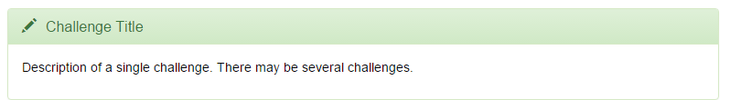

## Week 1: Getting started

During this week we will post introductions, setup software, start thinking 
about project organization and begin learning about the Unix Shell. At the end 
of each lesson page there are "Challenge Questions". They look like this:

Each week I will ask you to submit your answers to these challenges to Blackboard. 
There are no challenges due in Week 1. 

### Posting introductions

Go to [the course discussion board on BlackBoard, enter the "introductions" forum](https://my.unl.edu/webapps/discussionboard/do/forum?action=list_threads&nav=discussion_board_entry&course_id=_165403_1&conf_id=_228448_1&forum_id=_258266_1)
, click "Create thread", and introduce yourself! What are you doing at NU? Please 
also post a photograph of yourself. This is mostly for my benefit. Otherwise,
we meet on campus somewhere and I've no idea why you know me but I don't know 
you! 

### Setup software

Before the first synchronous session on Tuesday, January 12, please install all the 
[software listed on the main course website](index.html#setup).

### Project Organization

* [Video Tutorial](https://youtu.be/pJmLIrUbo24)

Just me talking about organizing directories, sub-directories and filenaming. 

### Downloading the data and introducing the shell

* [Video Tutorial](https://youtu.be/lbzfyEVQ4xM)
* [Instructions for lesson setup](http://swcarpentry.github.io/shell-novice/)
* [lesson page](http://swcarpentry.github.io/shell-novice/00-intro.html)
* No questions to answer, just some deep background.

